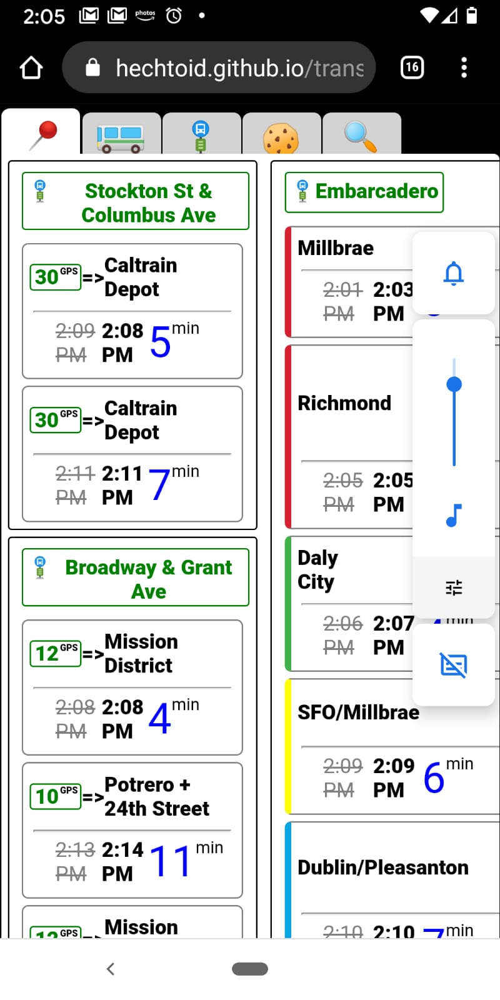

Every transit app accesses the same official api, found at https://511.org/open-data/transit. 

Most of them add graphical splash and fluff, not to mention location and other tracking.       
Both of these extraneous subroutines delay and obstruct our access to this public data.       

I thought I could do better, I know what data I want to see and how to ask for it. 

Originally this project was to contain only a few hardcoded bus stops &ndash; but the robust and well-documented api inspired me to expand the project to any local agency and all of their stops.   

The bulk of this work appears in the [transitsearch](src/components/transitsearch.js) file.

* The most complex piece is the live filter search, capable of handling more than five thousand stop objects with relative efficiency. 
    * One of my tricks for this is to only filter once there is enough input data for a meaningful result, as well as only refilling the array of stop objects upon deletion or reset of the input field.
        
            let stopFilter = e.currentTarget.value
            if (stopFilter.length === 1 && this.state.stopsFiltered.length < this.state.stops.length) {
                this.setState({ stopsFiltered: this.state.stops })
            }
            if (stopFilter.length < 3) {
                this.setState({ stopFilter })
            }
            else if (stopFilter.length <= this.state.stopFilter.length) {
                this.setState({stopFilter})
                if (this.state.stopsFiltered.length !== this.state.stops.length) {
                    this.setState({ stopsFiltered: this.state.stops })
                }
            }
            else if (stopFilter.length >= 3) {
                this.setState({ stopFilter })
                let searchTerms = stopFilter.toLowerCase().split(" ")
                let stopsFiltered = this.state.stopsFiltered.filter(...........

        

* I am also proud of the ways I handle missing or incomplete data, intelligently and conditionally falling back to alternate values. 
    * Here using a nested ternary:
    
            { this.props.title 
            ? this.props.title
            : stopName
                ? stopName
                : `${this.props.agency}#${this.props.stopCode}` }
    * And here using JavaScript's .then and .catch async controls, in series and in parallel, to seamlessly switch from prefetched to live stop lists.
                
            loadStops(e) {
                this.setState({ loaded: true })
                axios.get(`local.json`)
                .then(res =>{this.stopListIntegrator(res)})
                .catch( (err) => {
                    axios.get(`public.api`) 
                    .then (res =>{this.stopListIntegrator(res)})
                })
            }   

* Users can select which specific information they need to see, not just by stop but filter by line as well.

    

* Another feature I am fond of, and which I actually have not seen implemented elsehwere, is direct access to the Live Vehicle Tracking API. While riding a bus somebody asked me how long until we arrive at our stop - and I thought "hey, I know where to access that data!"
    * Mobile Optimized and embedded with Maps!
    * Simply enter the vehicle number (displayed prominently inside and out) and the app will load a map and schedule of upcoming stops. Depending on agency these are accurate to within one minute.

        
